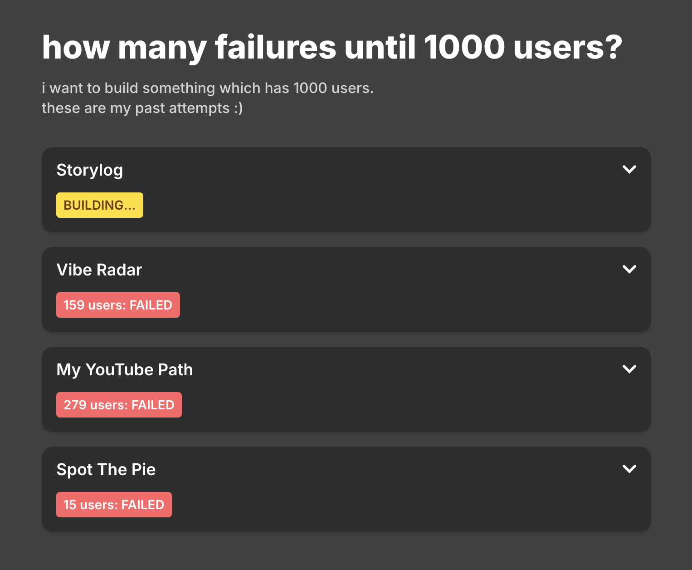

# Failures to 1000 Users

I document my failures until I succeed in building something with 1000 users.

This repo powers a small public tracker that lists my product attempts and shows user counts fetched from PostHog.



## Repo structure

```text
frontend/                     Next.js app (UI)
backend/lambdas/user-count/   Lambda function for user counts
terraform/                    Infra modules + environment
```

## Tech stack

- Frontend: Next.js 15, React 19, TypeScript, Tailwind CSS 4
- Backend: Python Lambda + `requests`
- Infra: Terraform (AWS + LocalStack)
- Analytics source: PostHog Insights API

## Local development (frontend only)

1. Install dependencies:

```bash
cd frontend
npm install
```

2. Create `frontend/.env.local`:

```bash
NEXT_PUBLIC_API_BASE_URL=http://localhost:4566/_aws/execute-api/<api-id>/<stage>/_user_request_
```

3. Start the app:

```bash
npm run dev
```

4. Open `http://localhost:3000`.

## Local API/infrastructure with LocalStack (optional)

Prerequisites:

- Terraform
- LocalStack running at `http://localhost:4566`

1. Create terraform variables file:

```bash
cp terraform/environments/localstack/terraform.auto.tfvars.example terraform/environments/localstack/terraform.auto.tfvars
```

2. Set `posthog_api_key` in `terraform/environments/localstack/terraform.auto.tfvars`.

3. Apply Terraform:

```bash
cd terraform/environments/localstack
terraform init
terraform apply
```

4. Copy the `api_url` output and use it as `NEXT_PUBLIC_API_BASE_URL` in `frontend/.env.local`.

## AWS deployment

AWS environment definitions live under `terraform/environments/aws`.
You need to provide `posthog_api_key` there as well before `terraform apply`.
